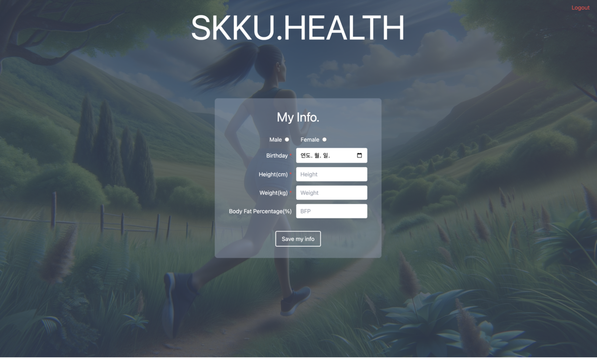
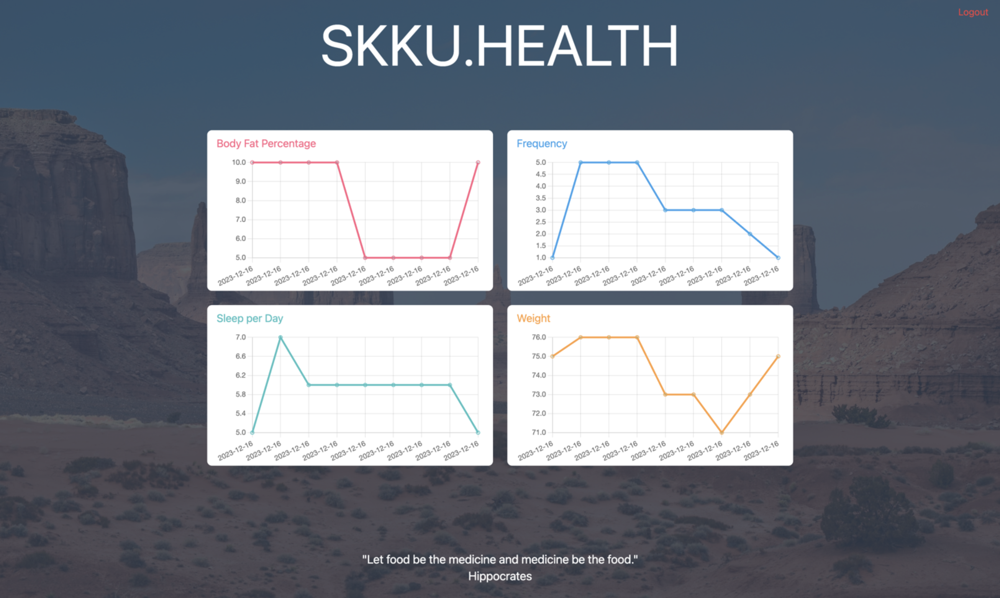

# VitaAI 💪

This project is a health management system created to provide personalized exercise/diet recommendations and visualization of health data trends, such as body fat, sleep, and weight, based on user input. It helps people effectively manage their health and obtain guidance on exercise types, frequency, intensity, and diet.

The system offers two primary features:
1. 🌟 Creating health-related advice through generative AI
2. 📊 Monitoring health data trends

## Introduction 🚀

Many people know what they need to do to achieve a fit and toned body, but often struggle with understanding how to do it effectively. To address this common concern, I developed a system where users can enter their health-related data — such as sleep duration, height, weight, body fat percentage, exercise frequency, intensity, type, and goals — and the AI will automatically perform a comprehensive analysis to generate personalized health advice. Additionally, the system recommends exercises that are tailored to each user's fitness goals. The aim of this project is to help more people lead healthier lives. 💚

## Features 🔍

### 1. 🌟 Creating health-related advice through generative AI
* Functionality: Users can enter their health and lifestyle data, and the AI will perform a comprehensive analysis to provide personalized health advice.
* Benefit: By receiving tailored advice that aligns with their specific health and fitness goals, users can manage their health more effectively.

### 2. 📊 Monitoring health data trends
* Functionality: Users can visually track changes in their health and lifestyle data over time, allowing them to monitor their progress and overall health trends.
* Benefit: This enables users to develop a more informed understanding of their health and lifestyle habits, supporting systematic health management.

## Screenshots 📸
### 📝 Sign-up Page

### 🔑 Log-in Page

### 🧑‍⚕️ Basic Health Info Input Screen

### 🏠 Home

### 📋 Entering Health/Lifestyle Info Before Getting AI-Generated Advice

### 🤖 AI Advice

### 📈 Data Trends Graph


## Installation 💻
1. **Clone the repository**

    ```bash
    git clone https://github.com/ryusudol/VitaAI.git
    ```

2. **Navigate to the project directory**

    ```bash
    cd VitaAI && npm install
    ```
    * recommended npm version: 10.8.0

3. **Create .env file**

    ```bash
    OPENAI_API_KEY="Your OpenAI API Key"
    ```

4. **Start the project**

    ```bash
    npm run dev
    ```
    or
    ```bash
    npm start
    ```
